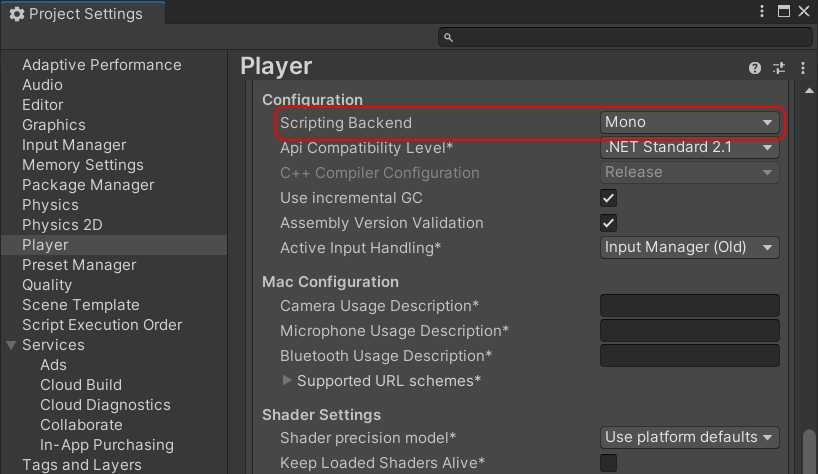

# UniMod

A Unity package that adds modding support to your project.
* **No content restrictions**. Mods can contain **assets** and **scripts**. *Scripts can be disabled*
* **Easy mod distribution and installation**. Mods are built into a single `.umod` archive file.
* **Easy setup**. Just add the `UniModContextInitializer` component to your scene.
* **Script debugging support**.
* **Seamless mod development experience**. Mods are developed using the Unity editor, either inside the original project or in a separate one.
* **Editor API** for mod building automation and other utilities.
* **Customizable mod build scripts** with fast iteration features:
  - Reuses the editor's precompiled assemblies to skip compilation.
  - Remembers your last build output location and configuration for one-click rebuilds.
  - Incremental builds to an already installed mod.
* **Dependency resolution system** that uses [Semantic Versioning 2.0.0](https://semver.org/):
  - Mods can be standalone or target a specific application ID and version.
  - Mods can declare dependencies on other mods specifying ID and target version.
  - Mods are loaded in the correct order based on their dependency graph.
* **Many options to distribute your project's modding tools**:
  - As a `.unitypackage` file.
  - As a custom Unity package for the Package Manager.
  - As a plugin.

> This package does **NOT** provide any security features regarding the script execution of mods. If you enable mod scripting in your project users should be warned to load mods under their own risk.

# Table of Contents
* [ Getting Started](#getting-started)
  * [Installation](#installation)
  * [Loading mods](#loading-mods)
  * [Implementing mods](#implementing-mods)
  * [Implementing mods inside the original project](#implementing-mods-inside-the-original-project)
* [Platform Support](#platform-support)
* [Used Technologies](#used-technologies)
* [State Of Development](#state-of-development)

# Getting Started

> This guide assumes that you are familiar with the following Unity features:
> * [Addressables](https://docs.unity3d.com/Packages/com.unity.addressables@latest/index.html)
> * [Assembly definitions](https://docs.unity3d.com/Manual/ScriptCompilationAssemblyDefinitionFiles.html)
> * [Custom packages](https://docs.unity3d.com/Manual/CustomPackages.html)

## Installation

Follow the next steps in your Unity project whether you are loading or implementing mods:

1. UniMod uses UniTask for all async operations, so you will need to [install it first](https://github.com/Cysharp/UniTask#install-via-git-url). *Note: I'm not the author of UniTask*.
2. Install UniMod by using the the following Git URL in the Package Manager (just like you did for UniTask):
    ```
    https://github.com/katas94/UniMod.git
    ```
3. If you want to enable scripting, you must make sure that your project is configured with the [Mono](https://docs.unity3d.com/Manual/Mono.html) scripting backend in your *Player Settings*. Go to `Edit > Project Settings...`, select `Player` and find the *Scripting Backend* option. Make sure that **Mono** is set:



## Loading mods

> Check the [UniMod Host Example](https://github.com/katas94/UniMod-HostExample) project.

Add the `UniModContextInitializer` component into any GameObject. UniMod will be initialized on the Awake method. You can setup the following options in the inspector:
* **Host Id**: in UniMod, an application that can load mods is called the *Host*, and it should declare an *ID* and *Version* so mods can properly target it. It is recommended to follow the `com.company.name` structure.
* **Host Version**: declare the version of your modding API. It doesn't necessarily need to be incremented if you update your project but leave the modding API untouched. You must follow the rules of [Semantic Versioning 2.0.0](https://semver.org/).
* **Support Standalone Mods**: if enabled, mods with no declared host target will be allowed.
* **Support Scripting In Mods**: if enabled, mods containgin scripting assemblies will be allowed.
* **Support Mods Created For Other Hosts**: if enabled, mods targeting other host IDs will be allowed. It probably makes no sense to ever allow for this since it is unlickely that mods for other projects will work properly.
* **Refresh Context On Start**: if enabled, the UniMod context will also be refreshed on the component's Start method. Refreshing the context will automaticaly install any mod files added to the installation folder and have them ready for loading.
* **Load All Mods On Start**: if enabled, all mods will be loaded automatically after the context has been refreshed (will do nothing if the previous option is disabled).

Your project is now ready to load mods! Checkout the [Host Example project](https://github.com/katas94/UniMod-HostExample) to know how you can expose a modding API for your modders.

## Implementing mods

> Check the [UniMod Mod Example](https://github.com/katas94/UniMod-ModExample) project.

If your mod is going to contain assets, you must initialize Addressables within the project. Create as many groups as you want and add all your mod assets to them so we can later specify what groups will be included in the mod build.

If your mod is going to contain scripts you must include them in [defined assemblies](https://docs.unity3d.com/Manual/ScriptCompilationAssemblyDefinitionFiles.html) so we can later specify what assemblies will be included in the mod build. You can define as many assemblies as you want.

Finally we will need to create a `ModConfig` asset to define the mod's configuration. Use the `Assets > Create > UniMod > Mod Config` menu to create the config anywhere in your project. Every option in the inspector has a tooltip that you can see when leaving the mouse over the field's label. Here are the most important ones:
* **Mod Id**: a unique ID to identify your mod. It is recommended to follow the `com.company.name` structure.
* **Mod Version**: the current version of your mod, mostly relevant if other mods will have a dependency on this one. You must follow the rules of [Semantic Versioning 2.0.0](https://semver.org/).
* **App Id**: the ID of the host that this mod is targeted to. If leaving this empty the mod will be considered standalone.
* **App Version**: the version of the host that this mod is targeted to.
* **Addressable Groups**: add here all the asset groups from your Addressables setup that you want to include in the mod.
* **Assembly Definitions**: add here all the assembly definitions that you want to include in the mod. You must **NOT** include here any assembly definitions from your target's API, as those will be already present when the mod is loaded.
> You will notice that the **Addressable Groups** and **Assembly Definitions** fields contain includes/excludes fields for folders and assets. This is because you can include/exclude entire folders from the project or include/exclude specific assets directly.

With your `ModConfig` asset ready, use the `Assets > Create > UniMod > Local Mod Builder` menu to create a builder asset and reference it from the **Builder** field in the `ModConfig`. You will see new tools at the bottom of the config's inspector:
* **Build**: will ask you for a build mode (Release or Debug) and prompt for the mod's output file name and location and build the mod after that.
* **Rebuild**: once you have performed a build, it will rebuild the mod with the previous parameters without asking for any configuration. Useful for fast iteration.
* **Development Build**: same as **Build** but it will prompt for a folder instead of an output file. This will directly produce a mod installation folder, so you can point it to your host mods folder to automatically deploy your mod ready to be loaded. Once you perform a development build, the development rebuild options will appear.
* **Development Rebuild: All**: rebuilds everything with the previous development build parameters.
* **Development Rebuild: Assemblies**: rebuilds the scripts only. It can be specially fast if you set the **Assembly Builder Type** to `Fast` in the `LocalModBuilder` asset so it reuses the editor's precompiled assemblies. Be aware that those assemblies have been compiled including the `UNITY_EDITOR` define.
* **Development Rebuild: Assets**: rebuilds the assets only. This will perform an Addressables content build.

Once you have your `.umod` file, you have to drop it on the host's local installation folder. This folder is located in `{UnityEngine.Application.persistentDataPath}/UniMods`. Checkout the [this Unity doc's](https://docs.unity3d.com/ScriptReference/Application-persistentDataPath.html) to see where the persistent data path is pointed to for your platform.

## Implementing mods inside the original project

If modders have access to the host's source code, they can develop their mods inside the host project to have the best experiencie, just like if they were developing a new feature. Assuming that you already have your mod assets inside the original project with your `ModConfig` asset properly configured, follow the next steps:
1. Create an `EmbeddedModConfig` asset using the `Assets > Create > UniMod > Embedded Mod Config` menu and reference it from the **Linked Embedded Config** field in the `ModConfig` asset. This config asset is automatically updated when entering Play Mode or performing a player build.
2. Add the `EmbeddedModSource` component to the same GameObject containing the `UniModContextInitializer`. If the host project is not using the `UniModContextInitializer` then just add the embedded mod source component to any GameObject and create an initialization script that adds it to the context by doing:
    ```C#
    UniModRuntime.Context.AddSource(embeddedModSource);
    ```
    You will need to refresh the context after that and load your mods.
3. Add your `EmbeddedModConfig` asset to the `EmbeddedModSource` component.

Now your mod should be registered in the context as if it were installed locally. You can also build the project and the mod will stay embedded.

# Platform Support

**Requires Unity 2021.3 or above**

With **mod scripting disabled**, UniMod will support any platform supported by Unity.

With **mod scripting enabled**, UniMod requires [Mono](https://docs.unity3d.com/Manual/Mono.html), with only the following platforms being implemented right now:
* **All standalone platforms** : Windows, OSX and Linux
* **Android**

If you are using a Mono compatible platform not listed above, you can extend the `CustomAssemblyBuilder` to specify how to build the managed scripting assemblies.

# Used Technologies

UniMod uses [Addressables](https://docs.unity3d.com/Packages/com.unity.addressables@latest/index.html) to build and load assets and the [System.Reflection.Assembly.Load()](https://learn.microsoft.com/en-us/dotnet/api/system.reflection.assembly.load?view=net-7.0) method to load managed .NET scripting assemblies. This means that [IL2CPP](https://docs.unity3d.com/Manual/IL2CPP.html) is currently not supported, so you can't use UniMod for platforms like **iOS**.

I believe that IL2CPP could be supported, but I did not have the time to do proper research on it so anyone interested that knows how to do it will be more than welcome to contribute :)

# State Of Development

I consider the initial development of this package done but I will start using it on a private project that will put it to the test. It could receive meaningful changes until I consider to release it as 1.0.0, although I find this unlickely since I'm very satisfied with the current design. Most likely I will be fixing bugs.

The package may not be stable yet so use it at your own risk.